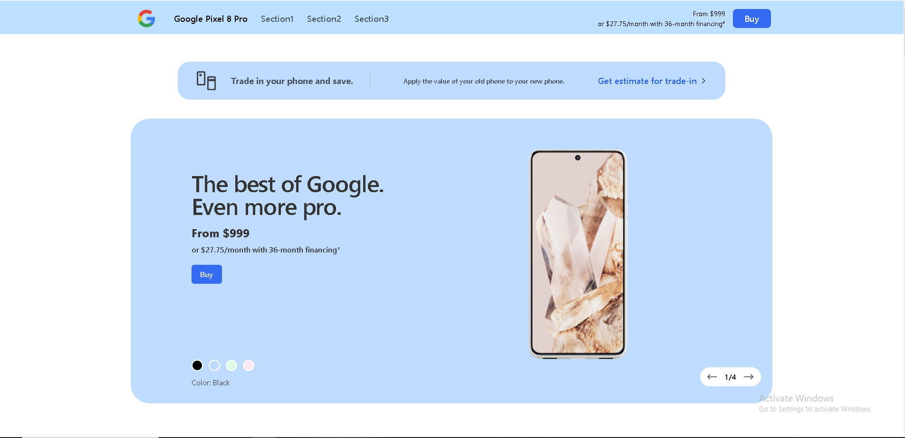
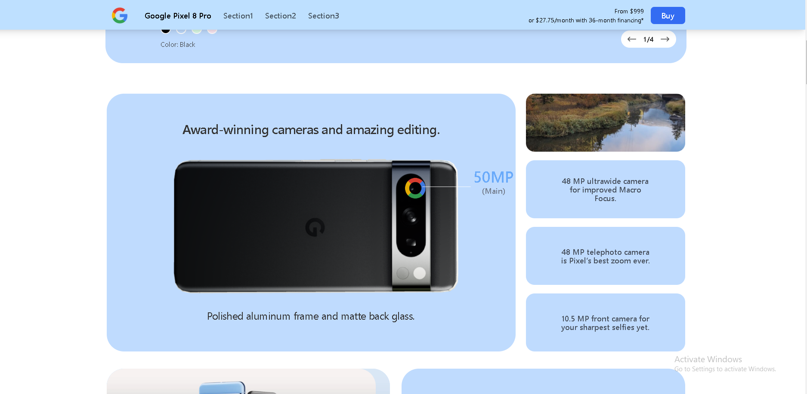
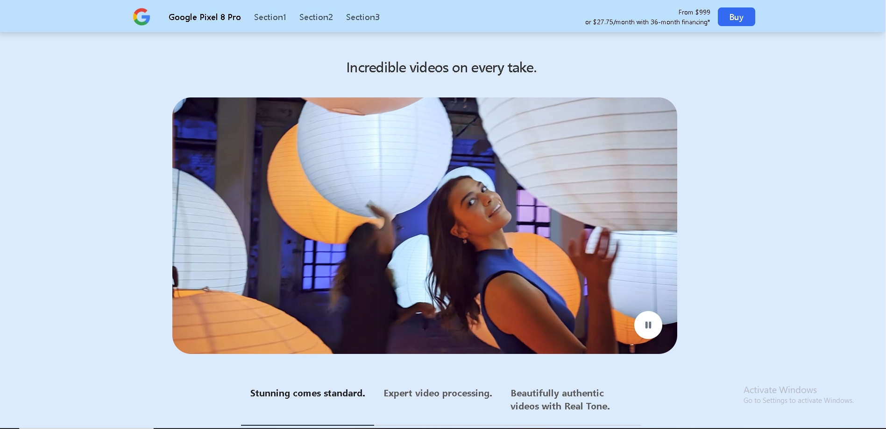
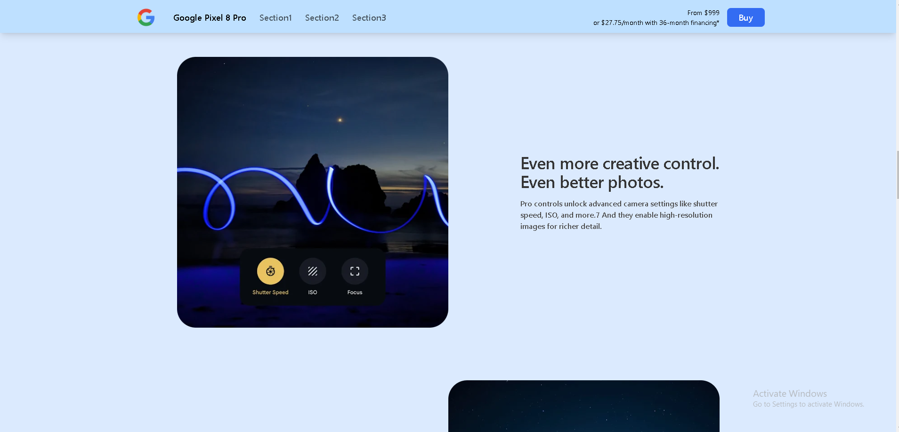
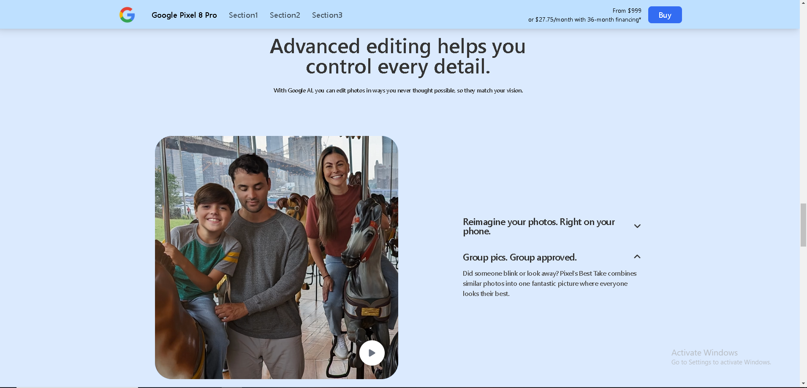
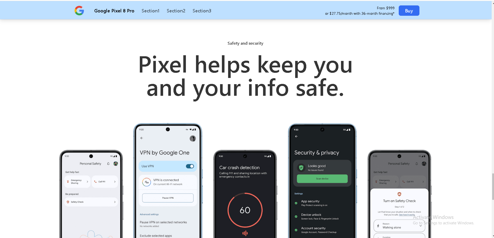
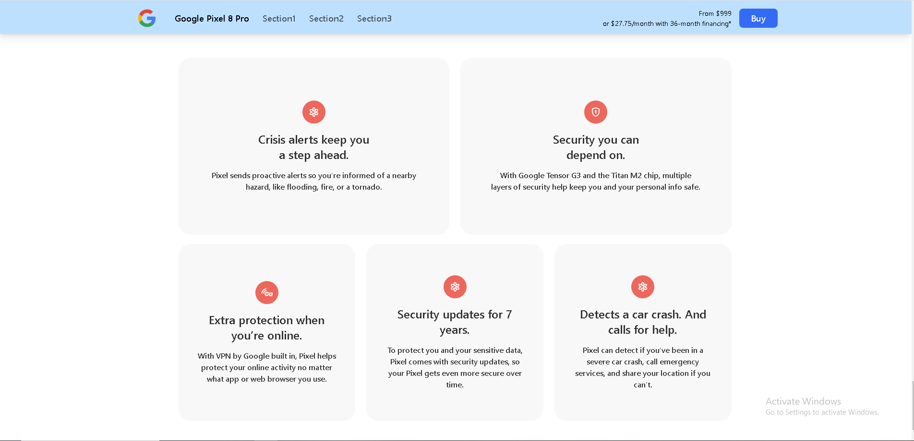

# Google Pixel 8 Pro 3D showcase

Welcome to the Google Pixel 8 Pro Showcase, an interactive 3D website designed to highlight the cutting-edge features of the Pixel 8 Pro. Built with GSAP and ScrollTrigger, this immersive experience combines smooth scrolling animations with 3D visuals, allowing users to explore the phone's sleek design, innovative technology, and advanced capabilities. Dive into the details with every scroll and experience the future of web interactivity.

You can see a video of the app here : 

## Table of Contents

- [Features](#features)
- [Screenshots](#screenshots)
- [License](#license)
- [Contact](#contact)

## Features

- **3D Phone Model**: Interact with a detailed 3D model of the Pixel 8 Pro, showcasing its sleek design and premium build.
- **Scroll-Triggered Animations**: Enjoy smooth and dynamic animations powered by GSAP and ScrollTrigger as you navigate the site.
- **Feature Highlights**: Explore key features of the Pixel 8 Pro, such as its advanced camera system, AI capabilities, and performance specs.
- **Responsive Design**: Optimized only for desktop and mobile.

## Screenshots

## Contact

For any questions or feedback, please contact:

- **Your Name**: [foxfireninetails9@gmail.com](mailto:foxfireninetails9@gmail.com)
- **GitHub**: [qbeeeeee](https://github.com/qbeeeeee)
